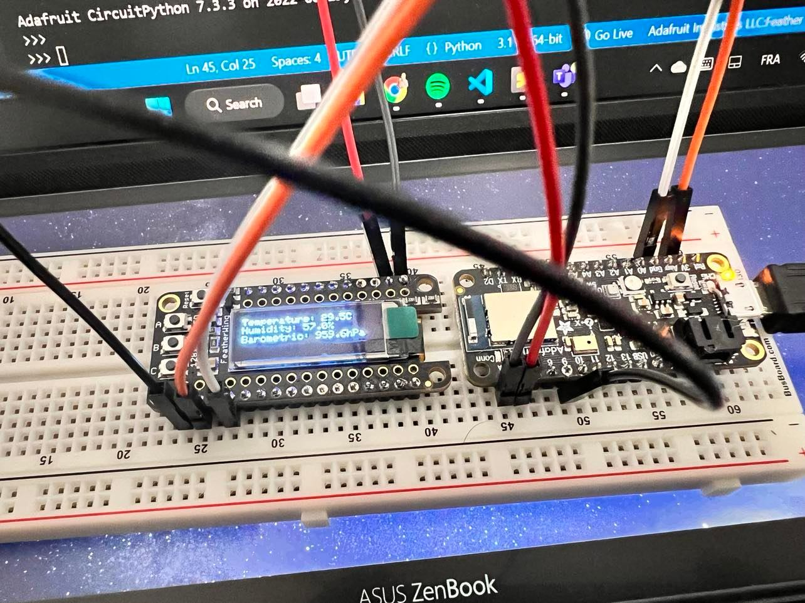
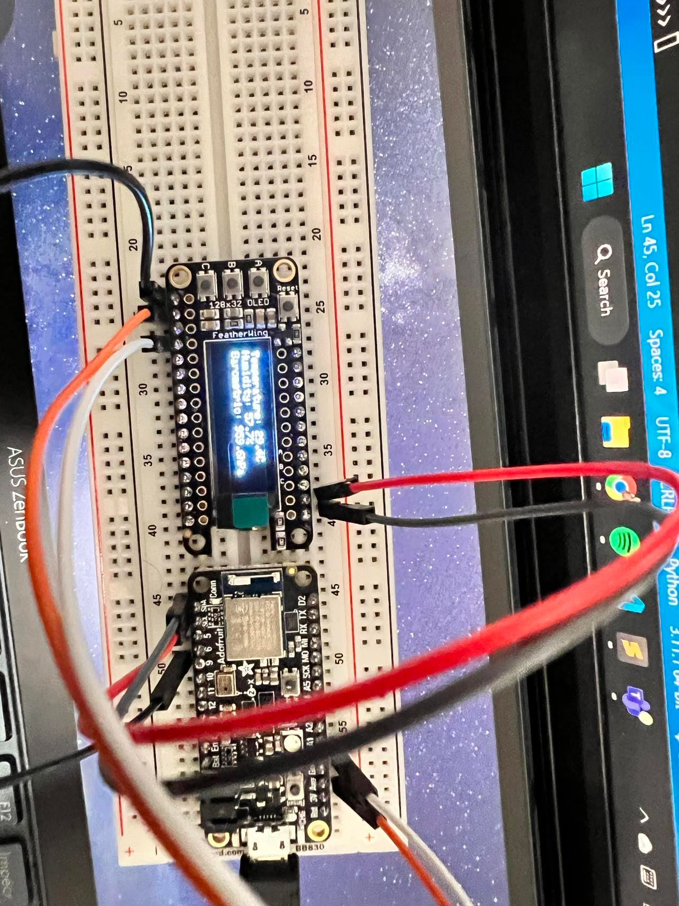

# nRF52840_Project
Small project that integrate the different sensors and actuators of the Adafruit Feather Bluefruit Sense, and potentially some of the different peripherals we have used in lab lab_esp32_micropython_intro.adoc

# GROUP 8
- [TAREQ MD RABIUL HOSSAIN CHY](https://www.linkedin.com/in/tareqmdrabiulhossainchy/)
- [NUSHRAT JAHAN](https://www.linkedin.com/in/nushrat-jahan-3275a9178/)

# Project Description
In this project we used nrf52 to take temperature, humidity, barometric pressure, gyro, magnetic infromation and displayed into oled. Proper connection and runing the code will display outputs on the oled display

# Components Used
- 1 nerf52840
- 1 Oled display 128x32
- 5 wires
- 1 USEB cable
- breadboard

We used Visual studio code to run the file.

# Connection
Here we can se the connection 

Figure 1. Circuit connection

Figure 2. Circuit connection

# References
- [Connection](https://learn.adafruit.com/assets/68726)
- [Oled pins](https://learn.adafruit.com/adafruit-oled-featherwing/pinouts)
- [Display](https://embedded-things.blogspot.com/2022/03/seeed-xiao-ble-sense.html)
